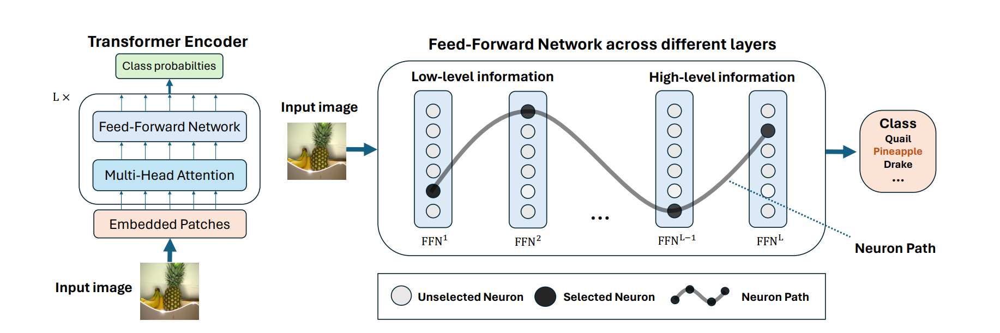

# Neuron Path

This repository contains the codes for the ICLR 2025 paper "[Discovering Influential Neuron Path in Vision Transformers](https://openreview.net/forum?id=WQQyJbr5Lh)". 

For more information, please contact [Yifan Wang](https://zc0in.github.io/) (wangyf7@shanghaitech.edu.cn) and [Kan Ren](https://www.saying.ren/) (renkan@shanghaitech.edu.cn).




> ## Abstract
> Vision Transformer models exhibit immense power yet remain opaque to human understanding, posing challenges and risks for practical applications. While prior research has attempted to demystify these models through input attribution and neuron role analysis, there’s been a notable gap in considering layer-level information and the holistic path of information flow across layers. In this paper, we investigate the significance of influential neuron paths within vision Transformers, which is a path of neurons from the model input to output that impacts the model inference most significantly. We first propose a joint influence measure to assess the contribution of a set of neurons to the model outcome. And we further provide a layer-progressive neuron locating approach that efficiently selects the most influential neuron at each layer trying to discover the crucial neuron path from input to output within the target model. Our experiments demonstrate the superiority of our method finding the most influential neuron path along which the information flows, over the existing baseline solutions. Additionally, the neuron paths have illustrated that vision Transformers exhibit some specific inner working mechanism for processing the visual information within the same image category. We further analyze the key effects of these neurons on the image classification task, show- casing that the found neuron paths have already preserved the model capability on downstream tasks, which may also shed some lights on real-world applications like model pruning.

### 1. Environment Setup
The code can be run under any environment with Python 3.8 and above.
(It may run with lower versions, but we have not tested it).

We recommend using [Conda](https://docs.conda.io/en/latest/) and setting up an environment:

    conda create --name neuron python=3.8

Next, install the required packages:

    pip install -r requirements.txt

We experimented in an Ubuntu environment

### 2. ImageNet1k Dataset Preparation
You should visit the [ImageNet official website](https://image-net.org/) to get the data. In our paper, we only use the validation set.
A dataset is a directory with the following structure:

    dataset
        ├── imagenet2012
        │   └── val
        |        └── ${image diractory}


### 3. Download Pre-trained model
Here are the models used in paper: ViT-B_16-224, ViT-B_32, ViT-L_32, MAE-B-16, they are all ImageNet21k pre-train + ImageNet1k fine-tuned models, you can get their weights by running:

```
mkdir ckpt
cd ckpt

# ViT-B_16-224, ViT-B_32, ViT-L_32
wget https://storage.googleapis.com/vit_models/imagenet21k+imagenet2012/{MODEL_NAME}.npz

# MAE-B-16
wget https://dl.fbaipublicfiles.com/mae/finetune/mae_finetuned_vit_base.pth
```

### 4. Neuron Path, Activation and Influence Pattern Extraction 
#### ViTs
After preparing the dataset and pretrain weight, you can extract Neuron Path and Activation by running:

    cd path
    python joint_attr.py --output_prefix imgnet_all --dataset $DATASET --dataset_path $DATASET_PATH --output_dir $OUTPUT_DIRECTORY --model_type $MODEL_TYPE --batch_size $BATCH_SIZE  --pretrain_weight $WEIGHT_PATH


And for Influence Pattern, you can get it by running:

    cd path
    python influence_pattern.py --output_prefix imgnet_all --dataset $DATASET --dataset_path $DATASET_PATH --output_dir $OUTPUT_DIRECTORY --model_type $MODEL_TYPE --batch_size $BATCH_SIZE --pretrain_weight $WEIGHT_PATH   
 
####  MAE
After preparing the dataset and pretrain weight, you can extract Neuron Path and Activation by running:

    cd path
    python joint_attr_mae.py --output_prefix imgnet_all --dataset $DATASET --dataset_path $DATASET_PATH --output_dir $OUTPUT_DIRECTORY --batch_size $BATCH_SIZE --pretrain_weight $WEIGHT_PATH

And for Influence Pattern, you can get it by running:

    cd path
    python influence_pattern_mae.py --output_prefix imgnet_all --dataset $DATASET --dataset_path $DATASET_PATH --output_dir $OUTPUT_DIRECTORY --batch_size $BATCH_SIZE --pretrain_weight $WEIGHT_PATH   

The output structure shows as follow:

    ${OUTPUT_DIRECTORY}
        ├── imgnet_all.args.json
        ├── imgnet_all-{label}.rlt.jsonl

### 5. Comparison

* To analyze *Joint Attribution Score* for different methods, you can run:

    | Notebook     |      Description      |
    |:----------|:-------------|
    | [Scores Analysis](experiments/quantitative-comparison/score/analysis/joint_attribution_score.ipynb)  | Analyze *Joint Attribution Score* for different methods |

* To conduct manipulation experiments on selected neurons, you can run:
    ```
    # For ViT model:
    cd experiments/quantitative-comparison/manipulation/ViT
    bash ./scripts/edit_logits.sh
    bash ./scripts/edit_accuracy.sh

    # For MAE model:
    cd experiments/quantitative-comparison/manipulation/MAE
    bash ./scripts/edit.sh
    ```
    You can refer to [ViT manipulation README](https://github.com/Zc0in/Neuron-Path/tree/release/experiments/quantitative-comparison/manipulation/ViT/README.md) and [MAE manipulation README](https://github.com/Zc0in/Neuron-Path/tree/release/experiments/quantitative-comparison/manipulation/mae/README.md) for more details.
    
* To analyze *Probability Deviation* and *Accuracy Deviation* for different methods, you can run:
    
    | Notebook     |      Description      |
    |:----------|:-------------|
    | [Plot Probability Deviation](https://github.com/Zc0in/Neuron-Path/tree/release/experiments/quantitative-comparison/manipulation/analysis/plot_probability_deviation.ipynb)  | Plot *Probability Deviation* for all models and methods |
    | [Accuracy Deviation for MAE](https://github.com/Zc0in/Neuron-Path/tree/release/experiments/quantitative-comparison/manipulation/analysis/accuracy_deviation_mae.ipynb)  | Give the *Accuracy Deviation* statistics of MAE model |
    | [Accuracy Deviation for ViT](https://github.com/Zc0in/Neuron-Path/tree/release/experiments/quantitative-comparison/manipulation/analysis/accuracy_deviation_vit.ipynb)  | Give the *Accuracy Deviation* statistics of ViT models |


### 6. Similarity

* To get Figure 4 in the paper, you can run:

        cd experiments/similarity
        python paper-plot.py

* To get all the plots, you can run:

        cd experiments/similarity
        python freq-figure-all.py

* To get the similarity between pairs, you can run:

        cd experiments/similarity
        python pair-sim.py

* To extract image given the name, you can run:

        cd experiments/similarity
        python name2img.py

### 7. Pruning

To reproduce the pruning experiments, first you need to generate the topK neurons by following command,

    cd topK/path
    python joint_attr.py --output_prefix imgnet_all --dataset $DATASET --dataset_path $DATASET_PATH --output_dir $OUTPUT_DIRECTORY --model_type $MODEL_TYPE --pretrain_weight $WEIGHT_PATH --topK $TOPK

where `$TOPK` can be anything number except 1.
Then you need to get the results of logits editing by following command,

    cd topK/experiments/quantitative-comparison/manipulation/ViT
    bash ./scripts/edit_logits.sh

and then run [plot_probability_deviation.py](topK/experiments/quantitative-comparison/manipulation/analysis/plot_probability_deviation.py)  to calculate mean accuracy. 

The plot method can be found in `experiments/quantitative-comparison/manipulation/analysis/plot_probability_deviation_new.ipynb`

You can refer to [ViT manipulation README](topK/experiments/quantitative-comparison/manipulation/ViT/README.md) for more details.

### 8. Citation

If you find our work inspiring or use our codebase in your research, please consider giving a star ⭐ and a citation.

```bibtex
@inproceedings{
wang2025discovering,
title={Discovering Influential Neuron Path in Vision Transformers},
author={Yifan Wang and Yifei Liu and Yingdong Shi and Changming Li and Anqi Pang and Sibei Yang and Jingyi Yu and Kan Ren},
booktitle={The Thirteenth International Conference on Learning Representations},
year={2025},
url={https://openreview.net/forum?id=WQQyJbr5Lh}
}
```
